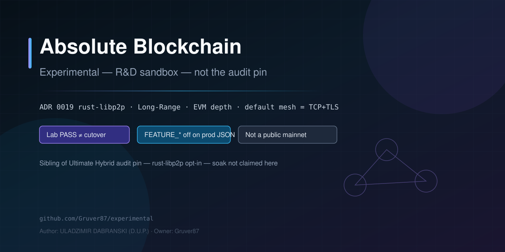

# Absolute Blockchain — Experimental sandbox



**R&D only.** rust-libp2p · Long-Range · EVM depth. **Not** the audit-freeze tree.

Canonical docs language is **English**. If GitHub shows a translation, open **View original**.

[](https://github.com/Gruver87/experimental/releases/tag/rd-1.0.0)
[](LICENSE)
[](https://github.com/Gruver87/experimental/actions/workflows/experimental-rd.yml)
[](https://github.com/Gruver87/experimental/actions/workflows/test.yml)
[](https://github.com/Gruver87/experimental/actions/workflows/security-audit.yml)

> **Industrial pin lives next door:** [`Absolute_Blockchain_Ultimate_Hybrid`](https://github.com/Gruver87/Absolute_Blockchain_Ultimate_Hybrid) · tag [`v1.3.1339-tip-v2-industrial`](https://github.com/Gruver87/Absolute_Blockchain_Ultimate_Hybrid/releases/tag/v1.3.1339-tip-v2-industrial)  
> **This repo:** Profile F labs. Default industrial transport remains **TCP+TLS**. Do not port these kernels onto the Hybrid pin.

**Default mesh = TCP+TLS.** `FEATURE_LIBP2P` / Cargo `libp2p` are **opt-in labs** — PASS here ≠ prod mesh cutover ≠ public mainnet.

Sandbox rules: [EXPERIMENTAL_SANDBOX.md](EXPERIMENTAL_SANDBOX.md) · Profile F: [EXPERIMENTAL_RD_PROFILE](docs/sprouts/EXPERIMENTAL_RD_PROFILE.md) · one-screen card: [AT_A_GLANCE](docs/AT_A_GLANCE.md)

---

## Start in 60 seconds

```bash
git clone https://github.com/Gruver87/experimental.git
cd experimental
pip install -r requirements.txt && cp .env.example .env
```

| OS | Native | R&D self-check | ADR 0019 hard (libp2p) |
|----|--------|----------------|------------------------|
| **Windows** | `.\scripts\build_native.ps1` | `python scripts/verify_experimental_rd.py` | `.\scripts\verify_adr0019_libp2p_hard.ps1 -Rebuild` |
| **Linux / macOS** | `make build` | same Python | `python scripts/verify_adr0019_libp2p_hard.py --rebuild` |

Explorer (solo): http://localhost:8080

---

## Proven vs not

| Claim | Status | Proof |
|-------|--------|-------|
| ADR 0019 rust-libp2p slices **A–CZ** (phase 103) | **Lab PASS** | hard gate **115** steps with `--rebuild` |
| Circuit never occupies crate ExternalAddresses | **Lab PASS** | Slices CW–CX |
| AutoNAT/UPnP confirm gated to advertised cap | **Lab PASS** | Slice CY |
| Identify observed confirm charges canonical key | **Lab PASS** | Slice CZ |
| Default mesh stays TCP+TLS | **By design** | `feature_libp2p=false` on prod JSON |
| Profile F Long-Range / EVM depth labs | **Lab only** | ADR 0017 · `EVM_COMPAT_MATRIX` |
| Hybrid 48h soak / firm audit / public mainnet | **No — other repo** | [Hybrid pin](https://github.com/Gruver87/Absolute_Blockchain_Ultimate_Hybrid) |
| Prod libp2p cutover | **No** | never flip audit-pin JSON |
| 48h soak on this tree | **Not run** | do not claim |

**Jump:** [Tracks](#what-is-active-here) · [Verify](#clone--verify) · [Docs](#docs-map) · [Contribute](CONTRIBUTING.md)

---

## What is active here

| Track | Status | Entry |
|-------|--------|-------|
| **ADR 0019 rust-libp2p** | Slices **A–CZ** (phase 103) behind Cargo `libp2p` | [ADR 0019](docs/adr/0019-rust-libp2p-industrial.md) |
| **ADR 0018 dual-stack / stubs** | Labs + adapter | `scripts/libp2p_*_lab.py` |
| **ADR 0017 Long-Range** | Lab / WS tip gate | `python scripts/long_range_lab.py` |
| **EVM depth / precompiles** | Profile F waves | [EVM_COMPAT_MATRIX](docs/sprouts/EVM_COMPAT_MATRIX.md) |

Latest ADR 0019 work lands on `main`. Historical slice PRs: [#16](https://github.com/Gruver87/experimental/pull/16).

---

## Clone & verify

### Experimental only (ADR 0019 hard — 114 steps, 115 with `--rebuild`)

```powershell
# Windows — rebuild native libp2p wheel when Rust changed
powershell -ExecutionPolicy Bypass -File scripts\verify_adr0019_libp2p_hard.ps1 -Rebuild
```

```bash
python scripts/verify_adr0019_libp2p_hard.py --rebuild
python scripts/verify_experimental_rd.py
```

### Hybrid + Experimental as one operator view

If the audit-freeze Hybrid clone sits next to this folder:

```powershell
powershell -ExecutionPolicy Bypass -File scripts\verify_absolute_unified.ps1 -Mode Standard
```

Report: `data/verify_absolute_unified.json`  
Honesty: two repos, one check — **not** a git merge / **not** prod libp2p.

---

## Build rust-libp2p wheel (opt-in)

```powershell
cd native\abs_native
$env:CARGO_TARGET_DIR = (Resolve-Path .\target).Path
maturin build --release --features "pyo3/extension-module,libp2p" --out ".\target\wheels"
cd ..\..
python -m pip install --force-reinstall --no-deps .\native\abs_native\target\wheels\abs_native-0.1.0-cp310-abi3-win_amd64.whl
```

Default Hybrid CI / prod mesh builds **without** the `libp2p` feature.

---

## Honesty (read this)

- Green lab / hard verify ≠ tip existence proof ≠ firm audit PDF.
- `feature_libp2p` must stay **false** on prod mesh JSON (`778888`).
- Do **not** push R&D into the audit-freeze Hybrid repo.
- ABS tokenomics in-repo model ≠ listed asset / public mainnet.
- Experimental tags are `rd-X.Y.Z` — **never** the Hybrid `v1.3.*-industrial` line.

---

## Docs map

| Need | Open |
|------|------|
| One-screen card | [AT_A_GLANCE](docs/AT_A_GLANCE.md) |
| Sandbox rules | [EXPERIMENTAL_SANDBOX.md](EXPERIMENTAL_SANDBOX.md) |
| rust-libp2p industrial slices | [docs/adr/0019-rust-libp2p-industrial.md](docs/adr/0019-rust-libp2p-industrial.md) |
| Architecture | [docs/ARCHITECTURE.md](docs/ARCHITECTURE.md) |
| Profile F flags | [docs/sprouts/EXPERIMENTAL_RD_PROFILE.md](docs/sprouts/EXPERIMENTAL_RD_PROFILE.md) |
| Releasing | [docs/RELEASING.md](docs/RELEASING.md) · [CHANGELOG](CHANGELOG.md) |
| Security / contribute | [SECURITY](SECURITY.md) · [CONTRIBUTING](CONTRIBUTING.md) · [SUPPORT](SUPPORT.md) · [Code of Conduct](CODE_OF_CONDUCT.md) |
| GitHub About paste | [REPO_PROFILE](.github/REPO_PROFILE.md) |
| Audit pin (other repo) | [Ultimate Hybrid](https://github.com/Gruver87/Absolute_Blockchain_Ultimate_Hybrid) · [EVIDENCE_MATRIX](https://github.com/Gruver87/Absolute_Blockchain_Ultimate_Hybrid/blob/master/docs/EVIDENCE_MATRIX.md) |

---

## Contribute

1. **Star** · **Watch → Releases**
2. Issues with lab/gate evidence — [CONTRIBUTING.md](CONTRIBUTING.md)
3. PRs to **`main`** (this sandbox). Never open Hybrid PRs for R&D kernels.

## License

MIT — [LICENSE](LICENSE)

---

*Author: ULADZIMIR DABRANSKI (D.U.P.) · Owner: [Gruver87](https://github.com/Gruver87) · Default branch: `main`*  
*Last surface update: **2026-08-15** — ADR 0019 through Slice **CZ** (phase 103) on `main`. Last tag `rd-1.0.0`. Not a launched public mainnet.*
