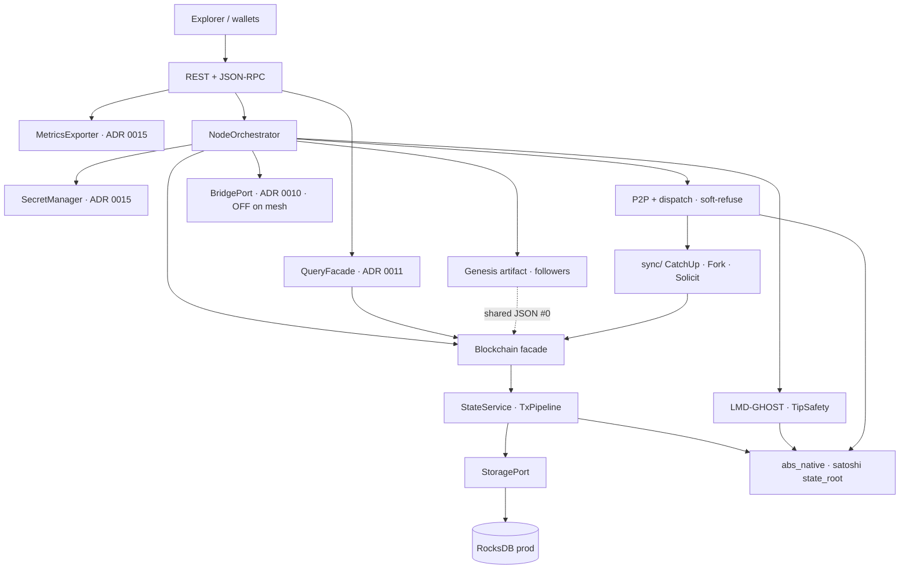

# Absolute Blockchain Ultimate Hybrid

> **EXPERIMENTAL SANDBOX COPY** - local R&D (`libp2p` / Long-Range / EVM depth).  
> **Not** the audit-freeze tree. See [EXPERIMENTAL_SANDBOX.md](EXPERIMENTAL_SANDBOX.md).  
> Audit pin lives in `Desktop\Absolute_Blockchain_Ultimate_Hybrid` / tag `v1.3.1339-tip-v2-industrial`.


**Python orchestrates. Rust owns the hot path.** Local prod-profile L1 mesh with evidence you can re-run — **not** a launched public mainnet.

[](https://github.com/Gruver87/Absolute_Blockchain_Ultimate_Hybrid/releases/tag/v1.3.1339-tip-v2-industrial)
[](LICENSE)
[](https://github.com/Gruver87/Absolute_Blockchain_Ultimate_Hybrid/actions/workflows/test.yml)
[](https://github.com/Gruver87/Absolute_Blockchain_Ultimate_Hybrid/actions/workflows/docker-prod-image.yml)
[](https://github.com/Gruver87/Absolute_Blockchain_Ultimate_Hybrid/actions/workflows/security-audit.yml)

> **Industrial pin:** [`v1.3.1339-tip-v2-industrial`](https://github.com/Gruver87/Absolute_Blockchain_Ultimate_Hybrid/releases/tag/v1.3.1339-tip-v2-industrial) · tip-v2 48h soak **PASS** · Phase 3–4 ops/audit binder **READY** · external firm audit **still pending**  
> Auditor one-pager → [AUDIT_ENGAGEMENT_BRIEF](docs/AUDIT_ENGAGEMENT_BRIEF.md) · one-screen card → [AT_A_GLANCE](docs/AT_A_GLANCE.md)

---

## Start in 60 seconds

```bash
git clone https://github.com/Gruver87/Absolute_Blockchain_Ultimate_Hybrid.git
cd Absolute_Blockchain_Ultimate_Hybrid
pip install -r requirements.txt && cp .env.example .env
```

| OS | Build native | Self-check | Run solo |
|----|--------------|------------|----------|
| **Linux / macOS** | `make build` | `make test-quick` | `python main.py` |
| **Windows** | `.\scripts\build_native.ps1` | `.\scripts\verify_project.ps1` | `python main.py` |

Explorer: http://localhost:8080 · Prod mesh (chain ID **778888**): `make mesh-up` or `.\scripts\docker_prod_3node.ps1`

---

## Why this repo is different

Most chain READMEs sell a roadmap. This one sells **reproducible evidence**.

1. **Claims map to artifacts** — every “PASS” links to a command or packed run under [`docs/evidence/`](docs/evidence/) / [`EVIDENCE_MATRIX`](docs/EVIDENCE_MATRIX.md).
2. **Fail-closed prod profile** — native crypto required, bridge **OFF** on live mesh, admin JWT + RPC API keys.
3. **Hybrid honesty** — Python owns orchestration; Rust (`abs_native`) owns crypto / satoshi state roots / Rocks / EVM kernels; gaps stay listed.

Not an investment product. **ABS** = in-repo tokenomics model (221M) — **not** a listed asset.

---

## Proven vs not

| Claim | Status | Proof |
|-------|--------|-------|
| Docker / local mesh bring-up | **Proven** | CI · `docker_prod_3node` |
| 3-node prod-profile sync (chain ID **778888**) | **Proven** | shared genesis · Path A catch-up |
| Mesh `/health/ready` (stable peers) | **Wave A/D local PASS** | `ready-check` ×3 · dual-dial · soft-refuse |
| Tip encoding v2 + satoshi apply | **Wave C local PASS** | `b_satoshi` · [79472a111cd5](docs/evidence/runs/79472a111cd5/) |
| Failover + signed tx + EVM on mesh | **Proven** | Jul 2026 suite |
| 48h soak (Jul float tip) | **PASS** (historical) | `logs/soak_report_48h.json` |
| 48h soak tip-v2 (`b_satoshi`) | **PASS** Aug 5–7 2026 | [375d14f](docs/evidence/runs/375d14f/) · fail=0 · mesh_warn=0 |
| Phase 3 ops cutover dry-run | **PASS** | [phase3-da25c34](docs/evidence/runs/phase3-da25c34/) |
| Phase 4 audit binder | **READY** | [phase4-691329c](docs/evidence/runs/phase4-691329c/) |
| Public mainnet / listed ABS / firm audit PDF | **No** | [MAINNET_GAP_ANALYSIS](docs/MAINNET_GAP_ANALYSIS.md) |
| Bridge on live mesh | **OFF** | by design until L1 cutover |

**Jump:** [Architecture](#architecture) · [Layout](#repo-layout) · [Ops](#operator-cheatsheet) · [Docs](#docs-map) · [Contribute](CONTRIBUTING.md)

---

## Architecture



| Plane | Owns | Notes |
|-------|------|-------|
| **Edge** | REST · JSON-RPC · Explorer | QueryFacade caps; no raw DB from handlers |
| **Orchestration** | `main.py` · consensus policy · secrets · shutdown | TipSafety enforce on prod |
| **Network** | TCP P2P · dispatch · catch-up/fork adapters | Soft-refuse; TLS churn can still leave `peer_count=0` |
| **Domain** | CatchUp · Fork · StateService · StoragePort | No sockets inside services |
| **Native** | `native/abs_native/` (PyO3) | Crypto · satoshi roots · Rocks · EVM kernels |
| **Sprouts** | ADR 0016 profiles | Bridge / L2 / shard **off** industrial mesh |

Full map + sequences: **[docs/ARCHITECTURE.md](docs/ARCHITECTURE.md)** · ADR index: **[docs/adr/](docs/adr/)** (0001–0016; **0013 unused**) · sprouts: **[docs/sprouts/](docs/sprouts/)**

---

## Repo layout

```text
native/abs_native/   Rust crypto · Rocks · EVM kernels (PyO3)  ← Cargo.toml here
network/             P2P TCP + dispatch + catchup/fork adapters
sync/                CatchUp Path A · ForkReconcile · SolicitHub
storage/             StoragePort · RocksDB adapter · open_storage
core/                Blockchain facade · StateService · TxPipeline
api/                 REST + JSON-RPC · QueryFacade (ADR 0011)
consensus/           LMD-GHOST (forest-deterministic) + finality
secret_mgmt/         SecretManagerPort (ADR 0015)
observability/       MetricsExporterPort · Prometheus (ADR 0015)
docs/adr/            boundaries 0001–0016 (0013 unused)
docs/sprouts/        ADR 0016 profiles (App · Bridge · L2 · Shard · EVM)
docs/evidence/       packaged soak / phase runs
scripts/             gates · mesh · soak · DR
Makefile             make build | verify | verify-industrial | mesh-up
```

---

## Operator cheatsheet

| Action | Windows | Linux / macOS |
|--------|---------|---------------|
| **Verify whole project** | `.\scripts\verify_project.ps1` | `make verify` |
| Industrial (tip-v2 48h evidence) | `.\scripts\verify_project.ps1 -Mode Industrial` | `make verify-industrial` |
| Legacy self-check | `.\scripts\check_all.ps1` | `make test-quick` |
| Start mesh | `.\scripts\docker_prod_3node.ps1 -SkipBuild -KeepVolumes` | `make mesh-up` |
| Probe | `.\scripts\probe_prod_mesh.ps1` | same via `pwsh` |
| Soak 48h | `.\scripts\soak_monitor.ps1 -ProdMesh -Hours 48` | same |
| Industrial gate only | `python scripts/industrial_gate.py --min-soak-hours 48` | same |
| Audit zip | `.\scripts\export_audit_pack.ps1` | same |

| Mode | Chain ID | Notes |
|------|----------|-------|
| `python main.py` | 77777 | Local solo |
| `docker_devnet_*.ps1` | 77777 | Lab mesh |
| `docker_prod_3node` / `make mesh-up` | **778888** | Prod-profile; bridge **OFF** |

Do **not** mix local `main.py` with Docker on the same host ports.

| Node | Explorer |
|------|----------|
| mesh-1 | http://127.0.0.1:18180 |
| mesh-2 | http://127.0.0.1:18181 |
| mesh-3 | http://127.0.0.1:18182 |

**Fail-closed prod:** `ABS_REQUIRE_NATIVE_CRYPTO` · `JWT_ENFORCE_ADMIN` · `RPC_API_KEY_REQUIRED` · bridge OFF · `python scripts/prod_gate.py`

---

## Maturity (honest)

| Area | Level |
|------|-------|
| L1 core · REST/Explorer · TX/EVM on mesh · Rocks path | Hardened R&D / Proven |
| P2P ready under TLS churn | Partial (soft-refuse yes; session churn open) |
| Failover + tip-v2 48h soak | Proven (operator-local evidence) |
| Bridge / Lightning / Plasma / WASM / ZK / PQ | Ports or R&D only — **OFF** industrial mesh |
| Public mainnet | **Not launched** |

Quality gate: CI · `make test-quick` / `check_all.ps1` · **2164+** pytest passed locally (2026-08-05)

---

## Docs map

| Need | Open |
|------|------|
| Proven vs not | [EVIDENCE_MATRIX](docs/EVIDENCE_MATRIX.md) |
| One-screen card | [AT_A_GLANCE](docs/AT_A_GLANCE.md) |
| Path to mainnet-v1 | [MAINNET_GAP_ANALYSIS](docs/MAINNET_GAP_ANALYSIS.md) |
| System design | [ARCHITECTURE](docs/ARCHITECTURE.md) |
| ADR boundaries | [docs/adr/](docs/adr/) |
| Auditor entry | [AUDIT_ENGAGEMENT_BRIEF](docs/AUDIT_ENGAGEMENT_BRIEF.md) · [AUDITS](docs/AUDITS.md) |
| Operator commands | [COMMANDS_REFERENCE](docs/COMMANDS_REFERENCE.md) · [ALL_COMMANDS](docs/ALL_COMMANDS.txt) |
| DR / industrial | [DISASTER_RECOVERY](docs/DISASTER_RECOVERY.md) · [INDUSTRIAL_HARDEN_RUNBOOK](docs/INDUSTRIAL_HARDEN_RUNBOOK.md) |
| Security / contribute | [SECURITY](SECURITY.md) · [CONTRIBUTING](CONTRIBUTING.md) · [SUPPORT](SUPPORT.md) |
| Releasing / hygiene | [RELEASING](docs/RELEASING.md) · [REPO_PROFESSIONAL](docs/REPO_PROFESSIONAL.md) |
| GitHub About paste | [REPO_PROFILE](.github/REPO_PROFILE.md) |

---

## Evidence snapshot

| When | What |
|------|------|
| Jul 19–21 | 48h soak **PASS** (float tip; historical) |
| Aug 2–4 | tip-v2 48h **FAIL** (historical only) |
| Aug 5–7 | tip-v2 48h **PASS** — [375d14f](docs/evidence/runs/375d14f/) |
| Aug 7 | Phase 3 **PASS** · Phase 4 binder **READY** |
| Aug 7 | Tag **`v1.3.1339-tip-v2-industrial`** — audit pin |

Full ledger: [EVIDENCE_MATRIX](docs/EVIDENCE_MATRIX.md)

---

## Tokenomics (in-repo model)

| Param | Value |
|-------|-------|
| Symbol | **ABS** |
| Max supply | **221 000 000** |
| Founder (D.U.P.) | **17.4%** |

`runtime/tokenomics.py` · `GET /tokenomics` — **not** a listed token.

---

## Contribute

1. **Star** · **Watch → Releases**
2. Issues with evidence (`data/check_all.json`) — [CONTRIBUTING.md](CONTRIBUTING.md)
3. PRs to **`master`** (real process — no fake history)

## License

MIT — [LICENSE](LICENSE)

---

*Author: ULADZIMIR DABRANSKI (D.U.P.) · Owner: [Gruver87](https://github.com/Gruver87) · Default branch: `master`*  
*Last update: 2026-08-08 — industrial pin `v1.3.1339-tip-v2-industrial` (`0531995`). External firm audit still pending. Not a launched public mainnet.*
