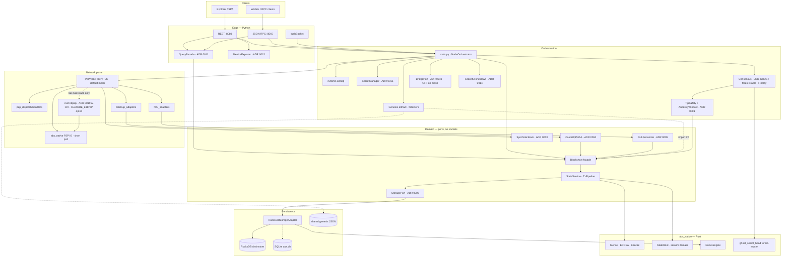
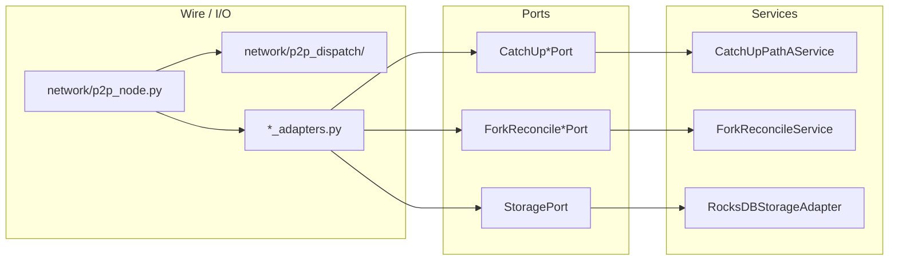
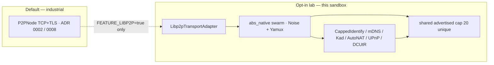
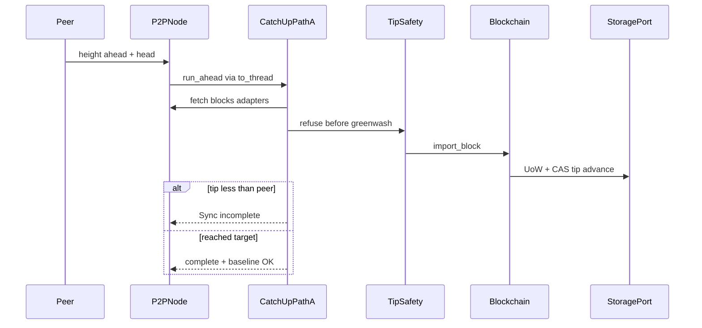
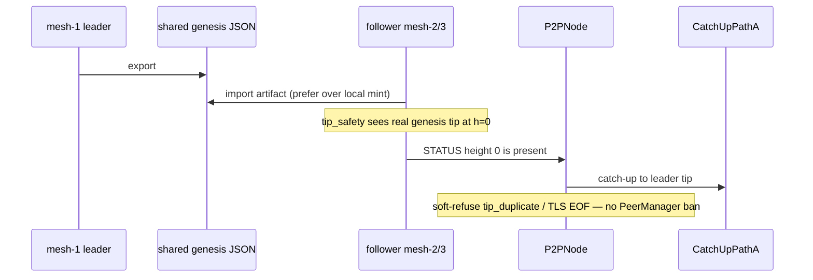
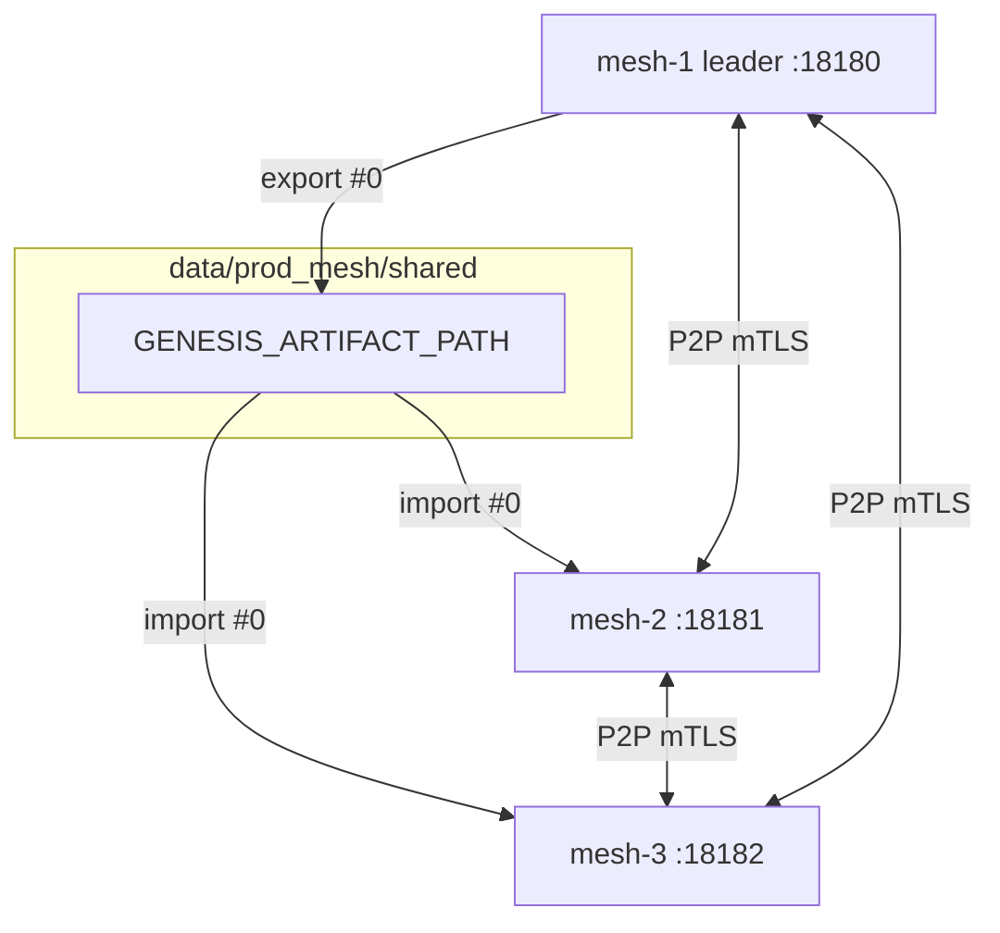

# Architecture (honest overview)

**Updated:** 2026-08-14  
**Scope:** [Gruver87/experimental](https://github.com/Gruver87/experimental) — R&D sandbox. Domain ports match Hybrid (ADR **0001–0016**); this tree also carries **0017–0019** labs.  
**Not** a launched public mainnet. **Not** the audit-freeze pin.  
**Industrial pin (sibling):** [`Absolute_Blockchain_Ultimate_Hybrid`](https://github.com/Gruver87/Absolute_Blockchain_Ultimate_Hybrid) tag [`v1.3.1339-tip-v2-industrial`](https://github.com/Gruver87/Absolute_Blockchain_Ultimate_Hybrid/releases/tag/v1.3.1339-tip-v2-industrial).

---

## One-line summary

**Python** owns orchestration (API, P2P TCP, consensus policy, secrets, metrics export). **Domain services** (`sync/`, `storage/`, `core/components/`) own catch-up, fork reconcile, state apply, and persistence behind ports. **Rust/PyO3** (`abs_native`) accelerates crypto, satoshi-integer state roots, RocksDB engine, and EVM kernels. **Prod** hot path = RocksDB; SQLite remains aux / dev.

**Honesty (mesh):** shared genesis + Path A catch-up are proven on chain ID **778888**. Tip encoding v2 + satoshi apply is Wave C proven (fresh mesh + tip-v2 48h soak PASS Aug 5–7). Stable `/health/ready` (alive peers under TLS reconnect) is **partial** — soft-refuse stops bans; session churn can still leave `peer_count=0`.

---

## System map



Solid = **prod-relevant hot path**. Dotted = **aux / cold / optional**.

ADR index: [docs/adr/](adr/) (**0001–0019**, 0013 unused; [README](adr/README.md)). Feature sprouts: [docs/sprouts/](sprouts/). Disaster runbooks: [DISASTER_RECOVERY.md](DISASTER_RECOVERY.md).

---

## Domain isolation (ADR stack)



| ADR | Boundary | What moved out of P2P / Blockchain |
|-----|----------|-------------------------------------|
| [0001](adr/0001-tip-safety.md) | TipSafety | Import refuse before tip/finality greenwash |
| [0002](adr/0002-p2p-transport-boundary.md) | Transport | Native frame / TLS policy at the edge |
| [0003](adr/0003-sync-consistency.md) | Solicit hub | Unsolicited `state_root` / blocks honesty |
| [0004](adr/0004-catchup-path-a.md) | Catch-up Path A | Ahead batch loop + `Sync incomplete` |
| [0005](adr/0005-fork-reconcile.md) | Fork / GHOST | Same-height reorg + fail-closed Evidence |
| [0006](adr/0006-storage-boundary.md) | StoragePort | Canonical UoW; `Blockchain` on `self.storage` |
| [0007](adr/0007-consensus-boundary.md) | ConsensusPort | Round SM + Evidence/lockdown; adapter façade |
| [0008](adr/0008-hotpath-wire-codec.md) | Wire codec | Hot-path encode/decode boundary |
| [0009](adr/0009-optional-native-fallback.md) | Native fallback | Optional Py path when native absent (prod forbids) |
| [0010](adr/0010-evm-bridge-boundary.md) | BridgePort | L1 lock-mint isolated; **OFF** on mesh |
| [0011](adr/0011-rpc-api-boundary.md) | QueryFacade | Typed reads; DoS caps; no raw DB |
| [0012](adr/0012-chaos-injection.md) | Chaos | Runtime fault injection (lab) |
| *0013* | — | **Intentionally unused** |
| [0014](adr/0014-graceful-shutdown-deep-health.md) | Shutdown / ready | SIGTERM · deep `/health/ready` |
| [0015](adr/0015-observability-secret-management.md) | Metrics / secrets | Exporter + SecretManager ports |
| [0016](adr/0016-feature-sprouts-profiles.md) | Sprouts | Profiles instead of kitchen-sink FEATURE_* |
| [0017](adr/0017-long-range-research.md) | Long-Range | Lab / weak-subjectivity — **not** prod |
| [0018](adr/0018-libp2p-transport.md) | Dual-stack stubs | Python labs; TCP+TLS remains default |
| [0019](adr/0019-rust-libp2p-industrial.md) | rust-libp2p | Slices **A–CP** (phase 93) behind Cargo `libp2p`; advertised unique cap 20 |

---

## Experimental dual-stack (ADR 0019)

TCP+TLS is still the **default** mesh. rust-libp2p is **opt-in** (`FEATURE_LIBP2P` / Cargo feature `libp2p`). Lab PASS ≠ prod cutover ≠ Hybrid pin.



Over-cap listen sockets are **omitted** from Identify, mDNS, Kademlia local addrs, AutoNAT probes, UPnP IGD maps, and DCUtR hole-punch candidates — not silently advertised. Identify also omits uncharged `NewExternalAddrCandidate` so they never reach the swarm. Circuit `/p2p-circuit` stays outside the cap. The unique advertised ceiling is **20** (rust-libp2p `ExternalAddresses` book); past that we **refuse**, because the crate silently evicts oldest confirmed externals. Advertised-externals persist replaces dest without unlinking it first (Windows `MoveFileExW`). Bootstrap, learned peerstore JSON, and identity keystore first-create use the same tmp+fsync+replace path (no truncate-in-place). Corrupt existing identity keys refuse spawn. NTFS replace is still **not** POSIX inode-atomic.

---

## Repo layout (where to look)

```text
main.py                 boot · wires storage + sync engines
api/                    REST + JSON-RPC + Explorer glue
network/
  p2p_node.py           TCP + thin sync/fork wires
  p2p_dispatch/         status / unsolicited / solicit handlers
  catchup_adapters.py   P2P → CatchUp ports
  fork_adapters.py      P2P → ForkReconcile ports
sync/
  catchup/              Path A service + types
  fork/                 ForkReconcileService + policy
  solicit.py            SyncSolicitHub
  genesis_artifact.py   shared ceremony #0 export/import
core/blockchain.py      domain apply · StoragePort only
storage/
  ports.py              StoragePort / UoW contracts
  adapters/             RocksDBStorageAdapter
  factory.py            open_storage(db)
consensus/
  adapter.py            façade (legacy API + RoundStateMachine)
  tip_safety/           TipSafety + AncestryWindow
  ports.py              ConsensusPort / ValidatorRegistryPort
  bft/                  Round SM · quorum · Evidence (ADR 0007)
native/abs_native/      Rust crypto · Rocks · P2P IO · EVM
runtime/                Config · prod smoke profile
docs/adr/               boundary decisions 0001–0019 (0013 unused)
docs/sprouts/           ADR 0016 feature profiles
scripts/                industrial_gate · mesh · soak
```

---

## What runs where

| Component | Language | Prod (778888 prep) | Dev (77777) |
|-----------|----------|-------------------|-------------|
| REST / RPC / WS | Python | Yes | Yes |
| P2P TCP + dispatch | Python | Yes (default) | Yes |
| rust-libp2p swarm | Rust PyO3 | **Off** (`feature_libp2p=false`) | Opt-in lab |
| Catch-up / fork services | Python domain | Yes | Yes |
| Consensus policy | Python | Unified LMD-GHOST + Round SM ports | Parallel/auto + Round SM |
| Consensus BFT quorum live | — | **Not claimed** (`finality_quorum_live=False`) | Same |
| TipSafety enforce | Python | **Required** | Optional |
| Blockchain domain | Python → StoragePort | Yes | Yes |
| State root / hashing | Rust PyO3 | Required | Required |
| Chain storage hot path | RocksDB via adapter | **Required** | SQLite default |
| Bridge L1 | Rust binary | **Off** until cutover | Optional |
| Lightning / Plasma / WASM / AI | Python modules | Blocked / aux | Enabled in dev |

---

## Sync & storage honesty (short)



### Follower boot (ceremony genesis)



---

## Multi-node deployment



| Claim | Status |
|-------|--------|
| Bring-up + shared genesis + chain heights | **Proven** |
| `/health/ready` always green (peers_alive) | **Partial** — TLS session churn open |
| Bridge on mesh | **OFF** |

Prod mesh: `scripts/docker_prod_3node.ps1` · probe: `scripts/probe_prod_mesh.ps1`

---

## Storage layout (prod)

See [STORAGE_ROCKSDB.md](STORAGE_ROCKSDB.md).

```
data/
  chainstore/     # RocksDB: blocks, accounts, txs, bridge, NFT marketplace, evm_logs
    aux.db        # SQLite sidecar: lightning/plasma/wasm/oracles and other cold modules
```

Domain code talks **StoragePort** only; engine unwrap remains for Wave-G API/P2P compat (`bc.db`).

Backup: `scripts/backup_chainstore.ps1 -DockerMesh1` · DR: `scripts/dr_restore_rehearsal.ps1`

---

## Quality gates

| Gate | Where |
|------|--------|
| CI pytest + native build | `.github/workflows/test.yml` |
| Docker prod image | `.github/workflows/docker-prod-image.yml` |
| Dependency audit | `.github/workflows/security-audit.yml` |
| Local full gate | `scripts/check_hybrid_full.ps1` |
| Industrial / needle honesty | `scripts/industrial_gate.py` |
| Prod profile enforcement | `scripts/prod_gate.py` |
| State consistency | `GET /chain/consistency/harness` |

---

## Related docs

- [EVIDENCE_MATRIX.md](EVIDENCE_MATRIX.md)
- [AUDIT_ENGAGEMENT_BRIEF.md](AUDIT_ENGAGEMENT_BRIEF.md)
- [PORTING_ROADMAP.md](PORTING_ROADMAP.md)
- [MAINNET_GAP_ANALYSIS.md](MAINNET_GAP_ANALYSIS.md)
- [STORAGE_ROCKSDB.md](STORAGE_ROCKSDB.md)
- [PUBLIC_TESTNET.md](PUBLIC_TESTNET.md)
- [DOCKER_IMAGES.md](DOCKER_IMAGES.md)
- [INDUSTRIAL_HARDEN_RUNBOOK.md](INDUSTRIAL_HARDEN_RUNBOOK.md)
- [adr/0019-rust-libp2p-industrial.md](adr/0019-rust-libp2p-industrial.md)
